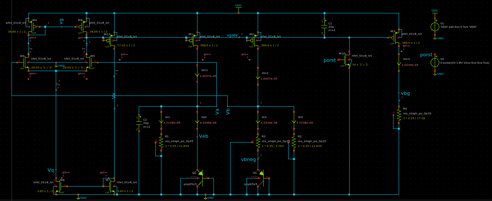
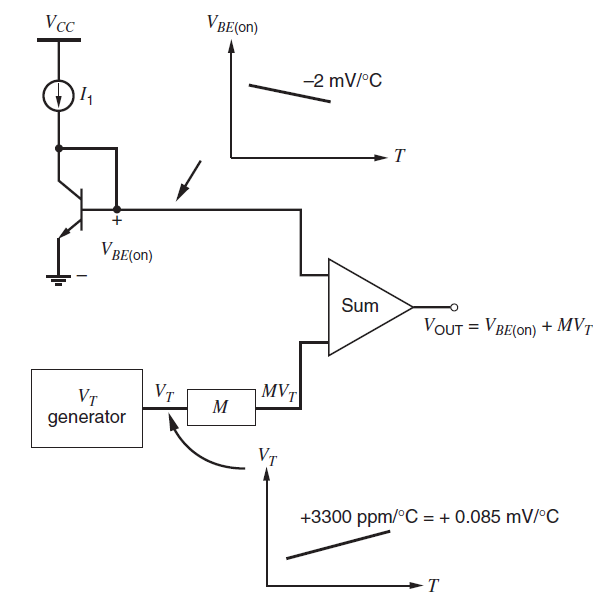

# stanford ee272b project - bandgap voltage reference in SKY130 technology
so you want to make a voltage reference. welcome.  
this readme will first cover what a bandgap circuit is and how it's supposed to work. if you know this already, skip past it to the "prerequisites" section to ensure you have the tools to use this repo.

## table of contents
1. what's a bandgap circuit?
2. how's the bandgap circuit work?
3. prerequisites
4. steps to set up the repository
5. design files
6. running all tests
7. viewing results
8. viewing unscripted results
9. test descriptions
10. test results

### what's a bandgap circuit?
a circuit which provides a voltage that's (ideally) independent of temperature. the circuit in this repository is shown below.

### how's the bandgap circuit work?
A bandgap circuit consists of the following blocks
  

a bipolar junction transistor (BJT) given some current, will produce a voltage between its base and emitter. This voltage is dependent on temperature and that dependence is *typically* around -2mV/degC. Notice that the dependence is negative (the negative dependence is usually called "complementary" to absolute temperature, or CTAT). the Vt generator is *typically* produced by taking the difference in base-emitter voltages between a pair of BJTs with **different current densities**, which is achieved by either supplying the BJTs with different currents, or by making the area of one BJT larger than the other. The temperature dependence of this difference, i.e. the output of the Vt generator, is *typically* +0.085mV/degC, **much** smaller than the CTAT voltage's dependence. Because this Vt dependence is positive, it's often reffered to as a proportional to absolute temperature (PTAT) voltage. The PTAT voltage is scaled (by *M* in the figure) such that when the CTAT and PTAT voltages are added, the resulting temperature dependence is zero, since the positive and negative temperature dependencies cancel out.  

# prerequisites
it's assumed that you've installed ngspice, skywater-pdk, Xschem_sky130, and Xschem. if you're missing one of these, please follow the steps in [this video](https://xschem.sourceforge.io/stefan/xschem_man/video_tutorials/install_xschem_sky130_and_ngspice.mp4). the written documentation for Xschem is available [here](http://repo.hu/projects/xschem/xschem_man/xschem_man.html).  

**note:** Xschem_sky130 is different from the skywater-pdk but is **entirely necessary.** make sure you have it installed.  

## steps to set up the repository
1. enter bash and source `caddy.bashrc` 
2. in `project-paths.json` fill in the **absolute paths** for each of the entries. my paths are left in that file as an example.  
3. `python edit-xschemrc-paths.py`  
4. `xschem &`. see if xschem opens without error. **important:** please launch xschem from this top directory. `xschemrc` must be in the current working directory, i.e. only launch `xschem` from the root of this repository.  
5. `File -> Open -> /path/to/repo/schematics/tsmc_bandgap_real.sch`  
hopefully, you can now see the full bandgap circuit schematic. try generating a netlist from this schematic; click `netlist` in the top right corner. to verify this worked, click the `simulation` tab in the top toolbar and then click `edit netlist`. a nano editor window should pop up, showing the various circuit components in the netlist.

## design files
the bandgap circuit is compact and the entire design schematic is contained in the following file  
`schematics/tsmc_bandgap_real.sch`  
**note:** you will need xscheme to open the above! if you just want to run the tests for this design, see the next section.

## running all tests
first, each `.spice` file must be generated through `xschem`.
1. `xschem &`
2. one by one, open the schematics in table below
3. click `Netlist` in the top right corner of the screen
4. repeat steps 2,3 for all tests
5. in `sims/` you should see the different tests in their `.spice` format
6. `python run-tests.py`
7. all of the tests will run. to view the relevant results, follow the steps of "viewing results"

## viewing results
There is a script to interpret the `ngspice` data generated from each test, i.e. to get the most salient information you can run these scripts  

| script | description | path to relevant script |
| ------ | ----------- | ----------------------- |
| `vdsat.py` | this script will read from the operating point simulation all of the vdsats and the vdsat margins. all margins should be positive to ensure the transistors can be in saturation. | `simulation_post_processing/vdsats.py` |
| `ppm.py` | this script will read from the transient simulation (no variation) to plot the start up of the circuit at 0, 27, and 70 degrees celsius. the script will also print out the ppm of the circuit. | `simulation_post_processing/ppm.py` |
| `variations.py` | this script will read from the transient simulation with variations to plot many startups of the circuit at 0, 27, and 70 degrees celsius. the script will also print out the mean and standard deviation of the resulting reference voltage | `simulation_post_processing/variations.py` |

### viewing unscripted results
a printout of relevant operating point voltages is available at `sims/tsmc_bandgap_real_op.out`.  

## running your own simulations
if you want to play with simulations yourself, use `schematics/tsmc_bandgap_real.sch` as your sandbox. the difference between this schematic and the schematics in the test descriptions table is that the schematics in the table have specific simulation commands attached to them. `schematics/tsmc_bandgap_real.sch` has many ngspice commands in the schematic, **which are enabled and disabled by the "spice_ignore" variable in the command listing.** if you want a set of simulation commands to be ignore, set `spice_ignore = True`, but if you want to use a set of simulation commands, set `spice_ignore = False`.


### test descriptions
| test | description | path to relevant schematic |
| ---- | ----------- | -------------------------- |
| operating point | this simulation solves for a dc operating point for the circuit at 27 degrees celcius. the operating point represents the dc behavior in steady state | `schematics/tsmc_bandgap_real_op.sch` |
| transient | this simulation is a time based simulation; the supply, VDD, is ramped up over 5 microseconds. a power on reset pulse is then applied. the circuit then settles into a desired operating point. this simulation performs the test at three temperatures: 0, 27, 70 degrees celcius. | `schematics/tsmc_bandgap_real_tran.sch` |
| transient, with VDD and some process variation | this test varies the following quantities: VDD, threshold voltage (Vth), gate oxide thickness (tox), offset voltage in the subthreshold region, subthreshold swing, ideal max forward beta, transport saturation current, and transport saturation curent's temperature effect exponent. each variation is according to a normally distributed Gaussian distribution. | `schematics/tsmc_bandgap_real_tran_gauss.sch` |
| temperature sweep | this simulation solves for an initial operating point at temp = 0 degC and then does an incremental Newton Raphson to solve for the opearting points at successive temperatures. | `schematics/tsmc_bandgap_real.sch` |

### test results
below are examples of what you should expect to see when running the tests.
#### `ppm.py`

#### `variation.py`

#### `vdsat.py`
```
vdsats
vdsat1 = 0.119118534825
vdsat13 = 0.119989426873
vdsat2 = 0.119117901861
vdsat3 = 0.117848616789
vdsat4 = 0.116704938791
vdsat5 = 0.0805043993246
vdsat6 = 0.124497921656
vdsat7 = 0.126205001268
vdsat8 = 0.116669110799
vdsat9 = 0.0805160282384
vdsmargins
vds1margin = 0.962670748553
vds13margin = 1.13964936048
vds2margin = 0.962545006157
vds3margin = 0.718283119402
vds4margin = 0.274703493756
vds5margin = 1.058842579
vds6margin = 0.144746667472
vds7margin = 0.414156211377
vds8margin = 0.281004171586
vds9margin = 1.05256610025
All Vds margins are positive
The lowest Vds margin is 0.144746667472
```
